# SmartLine Ride-Hailing Platform - Architecture Diagrams

## 1. High-Level System Architecture

```mermaid
graph TD
    subgraph "📱 Client Applications"
        Rider["👤 Customer App<br/>(Mobile/Web)"]
        Driver["🚗 Driver App<br/>(Mobile/Web)"]
        Admin["👨‍💼 Admin Panel<br/>(Blade Templates)"]
    end

    subgraph "🌐 Edge Layer"
        APILB["🔀 Nginx/API Load Balancer<br/>:80/443 (HTTPS + SSL)"]
        WSLB["🔌 WebSocket LB / DNS RR<br/>:3000 (WSS)"]
    end

    subgraph "⚙️ Laravel Backend Stack"
        Laravel["🔧 Laravel 10.x<br/>(REST API + Admin + Cron)"]
        Queue["⏳ Queue Workers<br/>(Supervisor)"]
        Scheduler["⏰ Task Scheduler<br/>(Cron)"]
    end

    subgraph "🔄 Node.js Realtime Service"
        Node1["📡 Node.js #1<br/>(Socket.IO, PM2)"]
        Node2["📡 Node.js #2<br/>(Socket.IO, PM2)"]
    end

    subgraph "💾 Data Layer"
        Redis[("🔴 Redis 7<br/>• Cache/Session/Queue<br/>• Pub/Sub Bridge<br/>• GEO Store (Drivers)<br/>• Distributed Locks")]
        MySQL[("🐬 MySQL 8.0<br/>Primary Database<br/>• Spatial Extensions<br/>• 164 Migrations")]
        Storage[("📁 Storage<br/>Local/Public/S3<br/>• Profile Images<br/>• Vehicle Photos<br/>• Documents")]
    end

    subgraph "🌍 External Services"
        Maps["🗺️ Maps & Geocoding<br/>• Google Maps API<br/>• Geoapify<br/>• GeoLink"]
        Pay["💳 Payment Gateways<br/>• Kashier • Stripe<br/>• Razorpay • PayPal<br/>• Bkash • Paytm<br/>(15+ Gateways)"]
        Push["🔔 Push Notifications<br/>• Firebase FCM<br/>• APNS"]
        SMS["📲 SMS Gateways<br/>• Twilio • Nexmo<br/>• MSG91 • 2Factor"]
        Email["📧 Email (SMTP)<br/>• Transactional Emails<br/>• Notifications"]
    end

    %% Client to Edge connections
    Rider -->|"REST/HTTPS"| APILB
    Driver -->|"REST/HTTPS"| APILB
    Admin -->|"HTTPS"| APILB
    Rider -->|"WebSocket/WSS"| WSLB
    Driver -->|"WebSocket/WSS"| WSLB

    %% Edge to Backend
    APILB --> Laravel
    Laravel --> Queue
    Laravel --> Scheduler

    %% WebSocket connections
    WSLB --> Node1
    WSLB --> Node2

    %% Laravel Data connections
    Laravel -->|"Eloquent ORM"| MySQL
    Laravel -->|"Cache/Session/Queue"| Redis
    Queue -->|"Background Jobs"| MySQL
    Queue -->|"Job Queue"| Redis

    %% Laravel to Node.js communication (via Redis)
    Laravel -->|"Publish: ride.*, payment events"| Redis
    Redis -->|"Pub/Sub Bridge"| Node1
    Redis -->|"Pub/Sub Bridge"| Node2

    %% Node.js to Redis (GEO)
    Node1 -->|"GEOADD Driver Locations"| Redis
    Node2 -->|"GEOADD Driver Locations"| Redis

    %% Node.js callbacks to Laravel
    Node1 -->|"HTTP: /internal/ride/*"| Laravel
    Node2 -->|"HTTP: /internal/ride/*"| Laravel

    %% External Services
    Laravel --> Storage
    Laravel -->|"Payment Processing"| Pay
    Laravel -->|"Distance/Route Calc"| Maps
    Laravel -->|"Push Notifications"| Push
    Laravel -->|"OTP/SMS"| SMS
    Laravel -->|"Emails"| Email

    %% Styling
    classDef clientStyle fill:#e1f5fe,stroke:#0277bd,stroke-width:2px
    classDef edgeStyle fill:#fff3e0,stroke:#ef6c00,stroke-width:2px
    classDef backendStyle fill:#e8f5e9,stroke:#2e7d32,stroke-width:2px
    classDef realtimeStyle fill:#fce4ec,stroke:#ad1457,stroke-width:2px
    classDef dataStyle fill:#f3e5f5,stroke:#6a1b9a,stroke-width:2px
    classDef externalStyle fill:#fff8e1,stroke:#ff8f00,stroke-width:2px

    class Rider,Driver,Admin clientStyle
    class APILB,WSLB edgeStyle
    class Laravel,Queue,Scheduler backendStyle
    class Node1,Node2 realtimeStyle
    class Redis,MySQL,Storage dataStyle
    class Maps,Pay,Push,SMS,Email externalStyle
```

---

## 2. Module Architecture (14 Business Modules)

```mermaid
graph TB
    subgraph "🏗️ SmartLine Modular Monolith Architecture"
        
        subgraph "👥 User Domain"
            UM["👤 UserManagement<br/>• Customers<br/>• Drivers<br/>• Profiles<br/>• Documents"]
            AM["🔐 AuthManagement<br/>• Login/Register<br/>• OTP Verification<br/>• Password Reset<br/>• Sanctum Tokens"]
        end

        subgraph "🚗 Trip Domain"
            TM["📍 TripManagement<br/>• Trip Requests<br/>• Driver Matching<br/>• Live Tracking<br/>• Trip History"]
            PM["📦 ParcelManagement<br/>• Parcel Delivery<br/>• Package Types<br/>• Delivery Tracking"]
            VM["🚘 VehicleManagement<br/>• Vehicle Types<br/>• Categories<br/>• Brands/Models<br/>• Driver Vehicles"]
        end

        subgraph "💰 Pricing Domain"
            FM["💵 FareManagement<br/>• Base Fares<br/>• Distance Pricing<br/>• Time Pricing<br/>• Surge Pricing"]
            ZM["🗺️ ZoneManagement<br/>• Polygon Zones<br/>• Zone Fares<br/>• Coverage Areas"]
            PRM["🎁 PromotionManagement<br/>• Coupons<br/>• Discounts<br/>• Loyalty Rewards<br/>• Banners"]
        end

        subgraph "💳 Payment Domain"
            GW["💳 Gateways<br/>• 15+ Payment Providers<br/>• Digital Wallets<br/>• Idempotency"]
            TR["📊 TransactionManagement<br/>• Payment Records<br/>• Refunds<br/>• Ledger"]
        end

        subgraph "🔧 Admin Domain"
            ADM["👨‍💼 AdminModule<br/>• Dashboard<br/>• Analytics<br/>• Configuration<br/>• Heat Maps"]
            BM["⚙️ BusinessManagement<br/>• Settings<br/>• Business Info<br/>• Localization"]
        end

        subgraph "📞 Communication Domain"
            CM["💬 ChattingManagement<br/>• In-app Chat<br/>• Trip Conversations<br/>• Support Chat"]
            RM["⭐ ReviewModule<br/>• Ratings<br/>• Reviews<br/>• Feedback"]
        end

    end

    %% Connections between domains
    TM -.->|"Find Drivers"| UM
    TM -.->|"Calculate Fare"| FM
    TM -.->|"Zone Validation"| ZM
    TM -.->|"Vehicle Matching"| VM
    TM -.->|"Apply Coupon"| PRM
    TM -.->|"Process Payment"| GW
    
    GW -.->|"Record Transaction"| TR
    AM -.->|"User Authentication"| UM
    PM -.->|"Delivery Vehicle"| VM

    classDef userDomain fill:#e3f2fd,stroke:#1565c0,stroke-width:2px
    classDef tripDomain fill:#e8f5e9,stroke:#2e7d32,stroke-width:2px
    classDef pricingDomain fill:#fff3e0,stroke:#ef6c00,stroke-width:2px
    classDef paymentDomain fill:#fce4ec,stroke:#c2185b,stroke-width:2px
    classDef adminDomain fill:#f3e5f5,stroke:#6a1b9a,stroke-width:2px
    classDef commDomain fill:#e0f7fa,stroke:#00838f,stroke-width:2px

    class UM,AM userDomain
    class TM,PM,VM tripDomain
    class FM,ZM,PRM pricingDomain
    class GW,TR paymentDomain
    class ADM,BM adminDomain
    class CM,RM commDomain
```

---

## 3. Trip Request Flow (Sequence Diagram)

---

## 4. Database Schema Overview

---

## 5. Security & Authentication Flow

```mermaid
flowchart TB
    subgraph "🔐 Authentication Layer"
        A1["📱 Mobile App<br/>Login Request"]
        A2["🔑 OTP Verification"]
        A3["🎫 Sanctum Token<br/>Generation"]
        A4["📋 JWT Token<br/>(WebSocket Auth)"]
    end

    subgraph "🛡️ Laravel Security Middleware"
        M1["🔒 auth:sanctum"]
        M2["⚡ throttle:60,1"]
        M3["🌐 CORS Middleware"]
        M4["🔄 LogContext<br/>(Correlation ID)"]
        M5["🔁 Idempotency<br/>(Payment Dedup)"]
    end

    subgraph "🔐 Node.js Security"
        N1["🎫 JWT Validation"]
        N2["🔌 Socket.IO Auth"]
        N3["📡 Rate Limiting"]
    end

    subgraph "💾 Data Security"
        D1["🔐 UUID Primary Keys<br/>(Prevents Enumeration)"]
        D2["🔒 bcrypt Passwords"]
        D3["🔑 Encrypted API Keys"]
        D4["🔐 Redis Auth<br/>(ACL)"]
    end

    A1 -->|"Phone + Password"| M2
    M2 -->|"Rate Limited"| A2
    A2 -->|"SMS OTP"| A3
    A3 -->|"Bearer Token"| M1
    M1 -->|"Authenticated"| A4
    A4 -->|"jwt_token"| N1
    N1 -->|"Valid"| N2

    M3 --> M4
    M4 --> M5
    M5 -->|"Protected APIs"| D1

    classDef authStyle fill:#e8f5e9,stroke:#2e7d32,stroke-width:2px
    classDef secStyle fill:#ffebee,stroke:#c62828,stroke-width:2px
    classDef nodeStyle fill:#e3f2fd,stroke:#1565c0,stroke-width:2px
    classDef dataStyle fill:#fff8e1,stroke:#f9a825,stroke-width:2px

    class A1,A2,A3,A4 authStyle
    class M1,M2,M3,M4,M5 secStyle
    class N1,N2,N3 nodeStyle
    class D1,D2,D3,D4 dataStyle
```

---

## 6. Deployment Architecture (Multi-VPS)

```mermaid
graph TB
    subgraph "🌐 Internet"
        Client["👥 Mobile Apps<br/>& Web Clients"]
    end

    subgraph "☁️ DNS & SSL"
        DNS["🌍 Cloudflare DNS<br/>• SSL Termination<br/>• DDoS Protection"]
    end

    subgraph "🖥️ VPS 1: Laravel Application"
        VPS1_Nginx["🔀 Nginx<br/>• Reverse Proxy<br/>• SSL Termination<br/>• Static Files"]
        VPS1_PHP["🐘 PHP-FPM 8.1<br/>Laravel Application"]
        VPS1_Supervisor["⏳ Supervisor<br/>Queue Workers"]
        VPS1_Cron["⏰ Cron<br/>Scheduler"]
        
        VPS1_Nginx --> VPS1_PHP
        VPS1_PHP --> VPS1_Supervisor
        VPS1_PHP --> VPS1_Cron
    end

    subgraph "🖥️ VPS 2: Node.js Realtime"
        VPS2_PM2["📡 PM2 Cluster<br/>Node.js Realtime<br/>(2-4 instances)"]
        VPS2_Nginx["🔀 Nginx<br/>WebSocket Proxy"]
        
        VPS2_Nginx --> VPS2_PM2
    end

    subgraph "🖥️ VPS 3: Data Layer"
        VPS3_MySQL["🐬 MySQL 8.0<br/>Primary Database"]
        VPS3_Redis["🔴 Redis 7<br/>• Cache<br/>• Sessions<br/>• Queue<br/>• GEO"]
        VPS3_Backup["💾 Backup System<br/>Daily Snapshots"]
        
        VPS3_MySQL --> VPS3_Backup
    end

    Client --> DNS
    DNS --> VPS1_Nginx
    DNS --> VPS2_Nginx
    
    VPS1_PHP -->|"MySQL/ORM"| VPS3_MySQL
    VPS1_PHP -->|"Cache/Queue"| VPS3_Redis
    VPS2_PM2 -->|"Pub/Sub"| VPS3_Redis
    VPS2_PM2 -->|"HTTP Callbacks"| VPS1_PHP

    classDef internetStyle fill:#e3f2fd,stroke:#1565c0,stroke-width:2px
    classDef vps1Style fill:#e8f5e9,stroke:#2e7d32,stroke-width:2px
    classDef vps2Style fill:#fce4ec,stroke:#c2185b,stroke-width:2px
    classDef vps3Style fill:#fff3e0,stroke:#ef6c00,stroke-width:2px

    class Client,DNS internetStyle
    class VPS1_Nginx,VPS1_PHP,VPS1_Supervisor,VPS1_Cron vps1Style
    class VPS2_PM2,VPS2_Nginx vps2Style
    class VPS3_MySQL,VPS3_Redis,VPS3_Backup vps3Style
```

---

## 7. Logging & Monitoring Architecture

```mermaid
flowchart LR
    subgraph "📥 Log Sources"
        L1["🔧 Laravel App"]
        L2["📡 Node.js WS"]
        L3["🐬 MySQL"]
        L4["🔴 Redis"]
    end

    subgraph "📊 Log Channels"
        C1["📋 api<br/>(7 days)"]
        C2["🔐 security<br/>(30 days)"]
        C3["💰 finance<br/>(365 days)"]
        C4["🔌 websocket<br/>(7 days)"]
        C5["⏳ queue<br/>(7 days)"]
        C6["⚡ performance<br/>(7 days)"]
    end

    subgraph "🔍 Monitoring"
        M1["📈 Sentry<br/>Error Tracking"]
        M2["📊 Telescope<br/>(Dev Only)"]
        M3["📉 Metrics<br/>Dashboard"]
    end

    L1 -->|"JSON Format"| C1
    L1 -->|"Auth Events"| C2
    L1 -->|"Payments"| C3
    L2 --> C4
    L1 --> C5
    L1 --> C6

    C1 --> M1
    C2 --> M1
    C3 --> M1
    C1 --> M2
    
    classDef sourceStyle fill:#e8f5e9,stroke:#2e7d32,stroke-width:2px
    classDef channelStyle fill:#e3f2fd,stroke:#1565c0,stroke-width:2px
    classDef monitorStyle fill:#fff3e0,stroke:#ef6c00,stroke-width:2px

    class L1,L2,L3,L4 sourceStyle
    class C1,C2,C3,C4,C5,C6 channelStyle
    class M1,M2,M3 monitorStyle
```

---

## 8. Payment Processing Flow

---

## 9. Technology Stack Summary

```mermaid
mindmap
    root((🚀 SmartLine<br/>Tech Stack))
        
        Backend
            Laravel 10.x
                PHP 8.1+
                Eloquent ORM
                Sanctum Auth
                Queue Workers
                Blade Templates
            Node.js 18+
                Socket.IO
                Express.js
                PM2 Cluster
                
        Database
            MySQL 8.0
                Spatial Extensions
                UUID PKs
                164 Migrations
            Redis 7
                Cache
                Sessions
                Queue
                Pub/Sub
                GEO Commands
                
        Security
            OAuth2/Passport
            JWT Tokens
            Rate Limiting
            CORS
            CSRF Protection
            
        External APIs
            Maps
                Google Maps
                Geoapify
                GeoLink
            Payments
                Kashier
                Stripe
                15+ Gateways
            Notifications
                Firebase FCM
                Twilio SMS
                
        DevOps
            Nginx
            Supervisor
            PM2
            Git
            Composer
            NPM
```

---

## 10. Production Readiness Status

### Deployment Blockers Summary

```mermaid
flowchart TD
    subgraph "⛔ TIER 1 BLOCKERS (App Breaking)"
        B1["🗺️ No Maps API Key"]
        B2["🔑 Missing Passport Keys"]
        B3["⚠️ DEBUG=true"]
        B4["🌐 Invalid APP_URL"]
        B5["💳 No Payment Gateway"]
        B6["🔧 No Server Config"]
        B7["🔓 Telescope Public"]
        B8["💾 No Backups"]
    end
    
    subgraph "⚠️ TIER 2 BLOCKERS (Feature Loss)"
        B9["📧 No SMTP"]
        B10["📱 No SMS Gateway"]
        B11["🔔 No Firebase"]
        B12["⏳ Sync Queues"]
        B13["📁 File Sessions"]
        B14["🔗 Dev URLs in WS"]
    end
    
    subgraph "ℹ️ TIER 3 (Operational)"
        B15["📊 Debug Logs"]
        B16["🔍 No Monitoring"]
        B17["🧪 No Tests"]
        B18["🌐 Open CORS"]
    end

    classDef tier1 fill:#ffcdd2,stroke:#c62828,stroke-width:2px
    classDef tier2 fill:#fff9c4,stroke:#f9a825,stroke-width:2px
    classDef tier3 fill:#c8e6c9,stroke:#2e7d32,stroke-width:2px

    class B1,B2,B3,B4,B5,B6,B7,B8 tier1
    class B9,B10,B11,B12,B13,B14 tier2
    class B15,B16,B17,B18 tier3
```

---

## Quick Reference

| Component | Technology | Port | Description |
|-----------|------------|------|-------------|
| **Laravel API** | PHP 8.1 + Laravel 10 | 8080 | REST APIs, Admin Panel |
| **Node.js Realtime** | Node.js 18 + Socket.IO | 3000 | WebSocket, Live Tracking |
| **MySQL** | MySQL 8.0 | 3306 | Primary Database |
| **Redis** | Redis 7 | 6379 | Cache, Queue, GEO, Pub/Sub |
| **Nginx** | Latest | 80/443 | Reverse Proxy, SSL |

---

*Last Updated: December 19, 2025*
*Version: 1.0.0*
